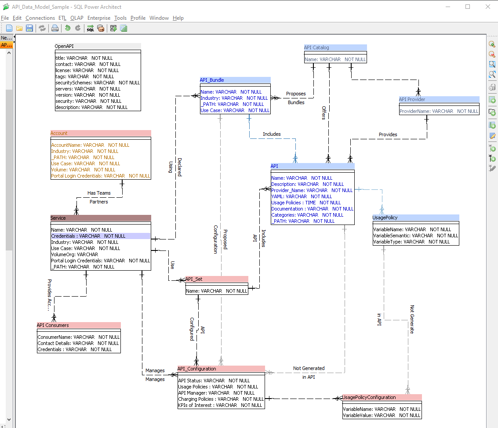
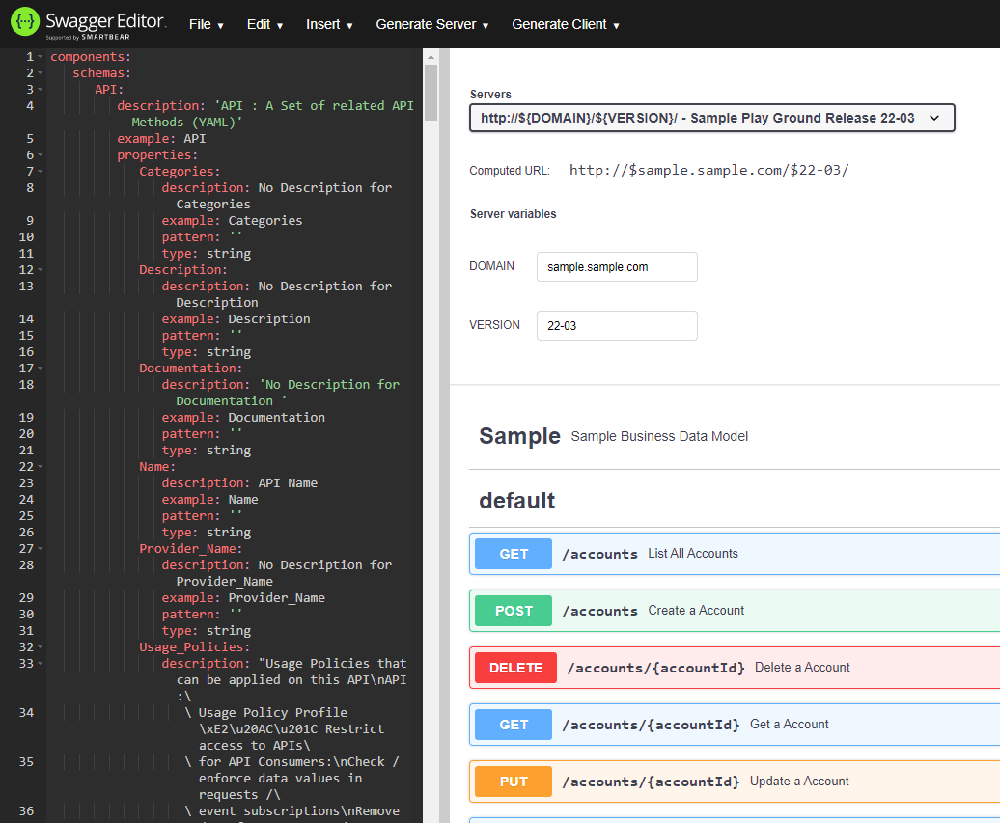
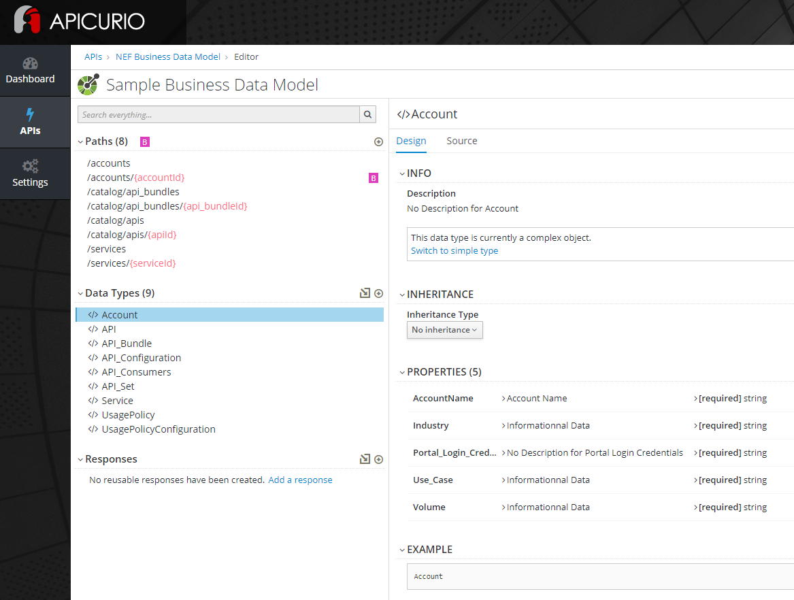
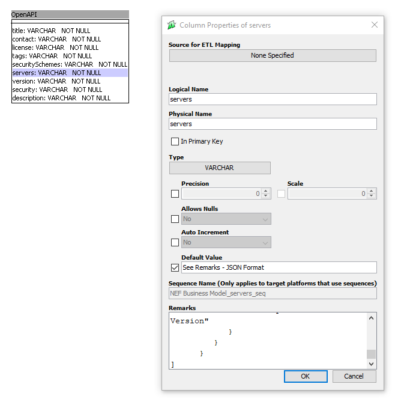
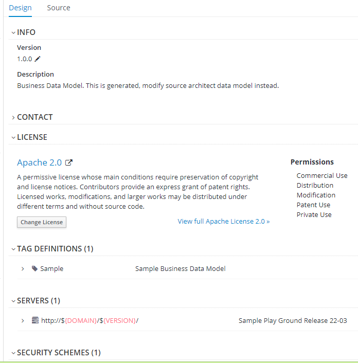
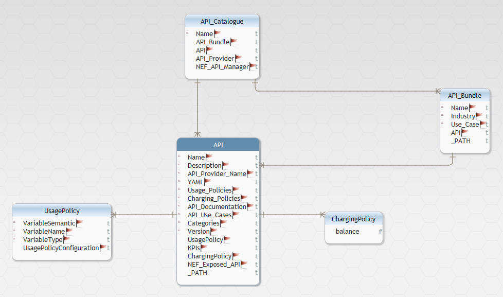
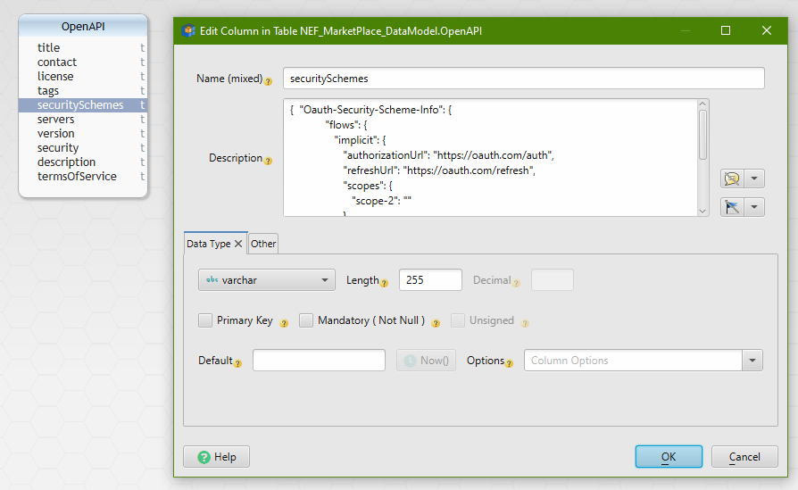

# SQL Architect to OpenAPI 

[This tool](https://github.com/bheuse/SQL_Architect_to_OpenAPI) converts an SQL Architect project into an OpenAPI 3.0.2 Data Model & CRUD Operations.

A JSON Schema can also be generated.

## Create your Data Model :

[Download SQL Architect](http://www.bestofbi.com/page/architect)

See below how to Model with SQL Architect for OpenAPI:

## Generate your API: 

    python    .\data_model_to_openapi.py .\API_Data_Model_Sample
    Reading : .\API_Data_Model_Sample.architect
    Ready   : .\API_Data_Model_Sample.yaml

## View your API: 

[View your APIs once generated in Swagger Editor : ](https://editor.swagger.io/)

[View your APIs once generated in Apicurio Studio](https://studio.apicur.io/)

## Next Steps:

Use OpenAPI Code Generation Tools like Swagger Editor or PostMan to generate server stubs or client SDK.

## How to Model in SQL Architect for OpenAPI:

The content of the SQL Architect Data Model in SQL Architect will be used as follow:

    Table:
        Logical Name  = API Object Type
        Physical Name = Examples    
        Remarks       = Description 
        Primary Key   = Not Used (complex)  
        Ignore : if the Physical name contain "ignore", the object schema will not be generated

        Attribute:
            Logical Name  = API Property Name
            Physical Name = Examples
            Remarks       = Description
            Allow Nulls   = Required / Optional if Ticked
            Type          = String, Integer, Time, Boolean
            Default Value = Pattern 

        Relation:
            Name        = If FK name contains ignore, the relation will nor refer to sub-object attribute
            Description = PK Label + FK Label
            Cardinalite = <NOT IMPLEMENTED>

        Special Attributes
            Name          = _PATH (Generates a CRUD list of operations for this object)
                            _PATH Physical Name : Used as PATH Name
                            _PATH Default value : Used as Path Name Prefix
                            _PATH Remarks : if contains read-only => only get - otherwise get / put / post / delete

    The "OpenAPI" Table is used to define the API details in  attributes:
        "title"           : Physical Name used as API Title
        "description"     : Physical Name + Remarks used as API Description
        "version"         : Physical Name used as API Version
        "contacts"        : Remarks in JSON Format used as API Contacts
        "license"         : Remarks in JSON Format used as API License
        "tags"            : Remarks in JSON Format used as API tags
        "servers"         : Remarks in JSON Format used as API Servers
        "security"        : Remarks in JSON Format used as API Security
        "securitySchemes" : Remarks in JSON Format used as API SecuritySchemes

Table OpenAPI:

Becomes:

# DbSchema to OpenAPI 

DbSchema conversion is no longer supported - the freemium version does not allow to edit DB Schema. 

[This tool](https://github.com/bheuse/SQL_Architect_to_OpenAPI) converts a DbSchema project into an OpenAPI 3.0.2 Data Model & CRUD Operations 

## Create your Data Model :

[Download DbSchema](https://dbschema.com/)

Project Type muse be "LogicalDesign"

See below how to Model with DbSchema for OpenAPI:

## Generate your API: 

    python    .\db_schema_to_openapi.py .\API_Data_Model_Sample
    Reading : .\API_Data_Model_Sample.dbs
    Ready   : .\API_Data_Model_Sample.yaml

## View your API: 

[View your APIs once generated in Swagger Editor : ](https://editor.swagger.io/)

[View your APIs once generated in Apicurio Studio](https://studio.apicur.io/)

## Next Steps:

Use OpenAPI Code Generation Tools like Swagger Editor or PostMan to generate server stubs or client SDK.

## How to Model in DBSchema for OpenAPI:

The content of the DBSchema Data Model in DBSchema will be used as follow:

    Table: are mapped onto API Object 
        Table Name    = Mapped onto an API Object Type
        Description   = Description 
        Specification Options = Examples    
           Ignore : if the Specification Options contain "ignore", the object schema will not be generated
        Options Suffix         :  For Future use ?
        Options Append  Script : For Future use ?
        Options Prepend Script : For Future use ?
        Primary Key   = Not Used (complex)  

        Attribute:
            Name          = API Property Name
            Description   = <Description> [Examples: <Examples>]
            Examples      = [<Description> Examples:] <Examples>
            Mandatory     = Required / Optional if unticked
            Type          = varchar, text    -> string, 
                            integer, int     -> integer, 
                            date, datetime   -> string, 
                            boolean          -> boolean, 
                            numeric, decimal -> number
            Default Value = Pattern 

        Relations:
            Name        = If name contains ignore, the relation will nor refer to sub-object attribute
            Description = Description
            Entity      = Contained  Object (from table)
            Entity(?)   = Containing Object (to table)
            Type        = Cardinality : 
                          OneToOne => OneToOne  (single sub-object) 
                          others   => OnetoMany (array of sub-object)

        Special Attributes
            Name          = _PATH (Generates a CRUD list of operations for this object)
                            _PATH Containing Entity Name : Used as PATH Name
                            _PATH Default : Used as Path Name Prefix
                            _PATH Description : if contains 
                               read-only => only get operation 
                               otherwise => get / put / post / delete

    The "OpenAPI" Table is used to define the API details in  attributes:
        "title"           : Description used as API Title
        "description"     : Description used as API Description
        "version"         : Description used as API Version
        "contacts"        : Description in JSON Format used as API Contacts
        "license"         : Description in JSON Format used as API License
        "tags"            : Description in JSON Format used as API tags
        "servers"         : Description in JSON Format used as API Servers
        "security"        : Description in JSON Format used as API Security
        "securitySchemes" : Description in JSON Format used as API SecuritySchemes

